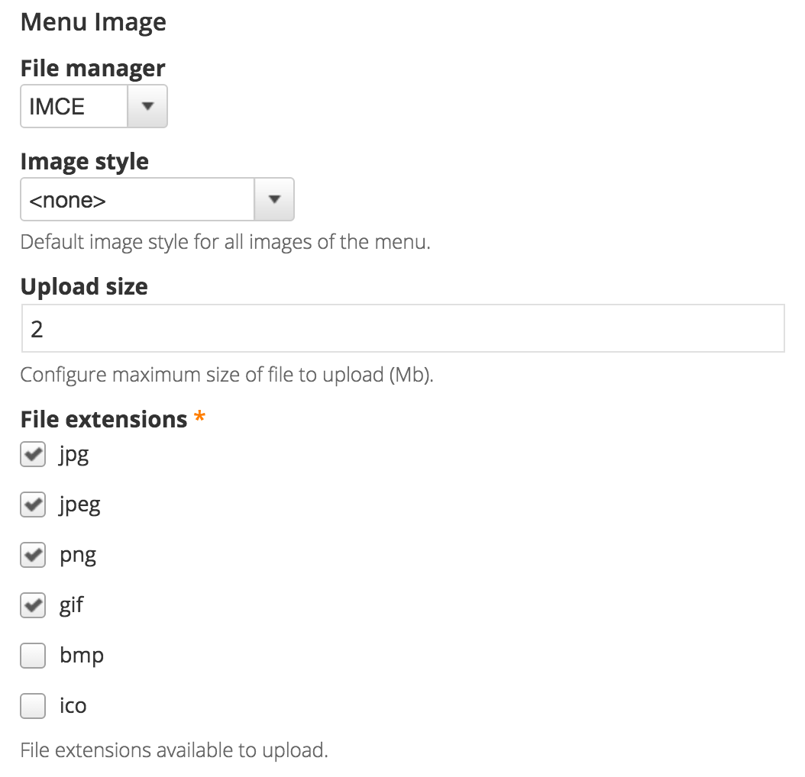
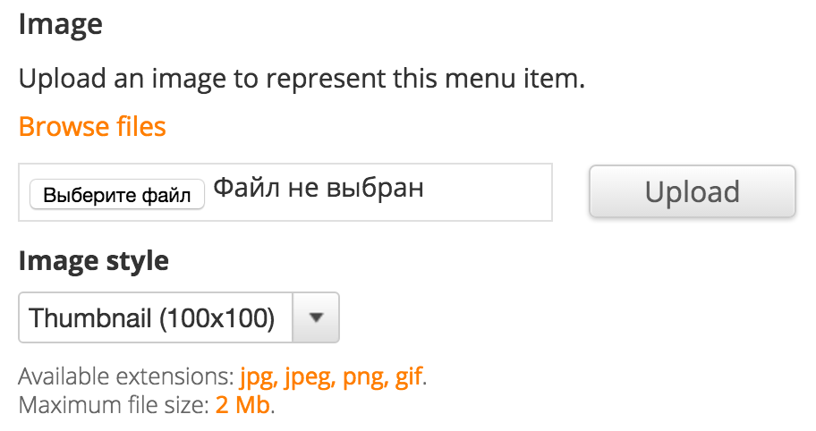
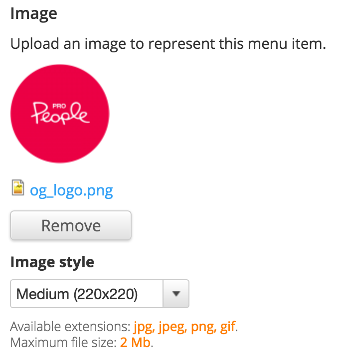

# Menu Image

Module provides a field to upload an image and associate it with menu item. The module based on [Managed File](https://drupal.org/project/managed_file) which gives the possibilities to choose style for an image and see the preview of uploaded file.

## Screenshots

Global settings for every menu.

Empty widget on menu link editing.

Widget with uploaded file and preview.

